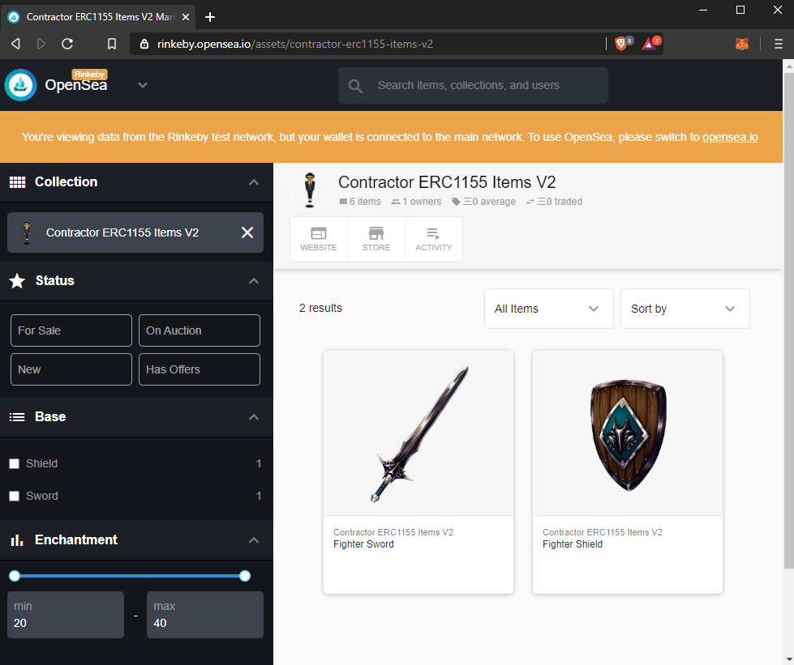

# 🕴 The CONTRACTOR

Here to help you create your smart contracts! 

The CONTRACTOR can help you:

* Mint an ERC1155 on Opensea in just 3 easy steps
* ... and more!

## Required software and accounts

 * [Node.js](https://nodejs.org/en/download/)
 * [Yarn](https://yarnpkg.com/getting-started/install)
 * [Infura](https://infura.io/)
 * [Pinata](https://pinata.cloud/)

#### [Optional] For Local Testing:
 * [Ganache](https://www.trufflesuite.com/ganache)
 
 ----
## 🚀 Getting Started With ERC1155 Example

### 1. Fork the repository

Click here to fork and create your own project.
* [](https://GitHub.com/alto-io/contractor/fork)

### 2. Create an .env file with the correct mnemonic and API keys

Inside the project directory, create a .env file containing the mnemonics and API keys. You can copy the [env.example](./.env.example).
```
GANACHE_MNEMONIC=[not needed for demo]
TESTNET_MNEMONIC=[mnemonic for wallet with about 2 Rinkeby ETH]
INFURA_API_KEY=[yourInfuraKey]
PINATA_API_KEY=[yourPinataAPIKey]
PINATA_SECRET_API_KEY=[yourPinataSecretAPIKey]
```

### 3. Have 🕴 The CONTRACTOR create your contracts and mint your items 

 * run `yarn demo` inside project directory, then wait a bit ⌛ The script will take a while to deploy the contracts on Rinkeby testnet. 
 * Once finished, the logs will display the contract details. Copy the `FactoryAddress` to your clipboard
 * In a browser, go to [https://rinkeby.opensea.io/get-listed/step-two](https://rinkeby.opensea.io/get-listed/step-two) and paste the contract address.
 * *That's it!* See the items you created on Opensea



----

## Creating Your Own Item Specs

* Put all images inside [erc155/images](./erc1155/images) 
* Define the metadata and contract URI in [erc1155/metadata.json](./erc1155/metadata.json) 

## Minting Items

 The demo mint parameters are defined in [MyLootBox.sol](./contracts/MyLootBox.sol#L186-L194), which pre-mints 1, 5, and 10 copies of the first 3 tokens respectively to the owner account. 
 
 This is a custom function based on the Opensea Factory implementation of ERC1155, [more info on how to customize it can be found here](https://docs.opensea.io/docs/opensea-erc1155-tutorial).

## Local Testing

For quicker development, you can use [Ganache](https://www.trufflesuite.com/ganache) for local smart contract deployment and testing.

* `yarn sol:deploy` deploys the smart contracts to ganache
  *  `GANACHE_MNEMONIC` should be defined in the `.env` file
  *  Make sure Ganache uses http://localhost:7545/ as the rpc url as specified in [truffle-config.js](./truffle-config.js)
* `yarn sol:test` runs tests in the [test directory](./test)

## Licenses

[](https://github.com/alto-io/contractor/blob/master/LICENSE)